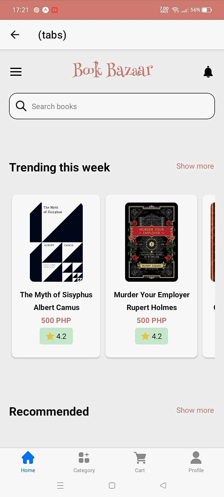

# Book Bazaar
BookBazaar Mobile App.

# Features
* Search Bar: A prominent search bar at the top of the app's interface allows users to quickly enter keywords and find relevant books.
* Personalized Recommendations: The app can suggest books based on users' past behavior, such as books they have viewed, purchased, or rated.
* Wishlist and Cart Functionality: Users can save books to a wishlist for future reference and add them to a cart for purchase.
* Users can explore books by category 

# Course Overview
* Basic React Native Components
* Database Design using Appwrite
* User Registration & Authenticaiton
* Deployment

# Tech Stack
* React Native
* AppWrite
* HTML, CSS and JS

# Home Screen
  

# Sign Up Screen
  

# Sign In Screen
  

# Tabs Screen
  